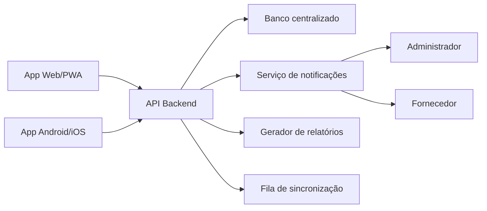

# Arquitetura Proposta

## Camadas do protótipo

- Interface: `src/app.js` renderiza as telas com base no usuário ativo e no estado.
- Dados iniciais: `src/data/seed.js` centraliza usuários, tipos de refeição e pedidos de demonstração.
- Regras e estado: `src/services/store.js` contém persistência local, consolidação, auditoria e regras de edição.
- Exportação: `src/services/exports.js` gera arquivos a partir dos filtros e consolidações.
- Offline: `service-worker.js` faz cache dos arquivos principais e `syncQueue` simula fila de sincronização.

## Arquitetura para produção

## Backend recomendado

Uma API REST ou GraphQL pode expor:

- `POST /auth/login`
- `GET /requests`
- `POST /requests`
- `PATCH /requests/:id`
- `POST /consolidations`
- `POST /consolidations/:id/send`
- `POST /consolidations/:id/confirmations`
- `GET /reports`
- `GET /reports/export`

## Banco centralizado

O arquivo `database/schema.sql` traz uma base relacional para PostgreSQL/Supabase. Ele já separa usuários, pedidos, consolidações, confirmações e auditoria.

## Offline e sincronização

No produto final:

- O app grava ações em IndexedDB quando offline.
- Cada ação recebe um `client_operation_id`.
- Ao voltar internet, o app envia a fila para o backend.
- O backend aplica operações de forma idempotente.
- Conflitos são resolvidos por regra de status e horário limite.
