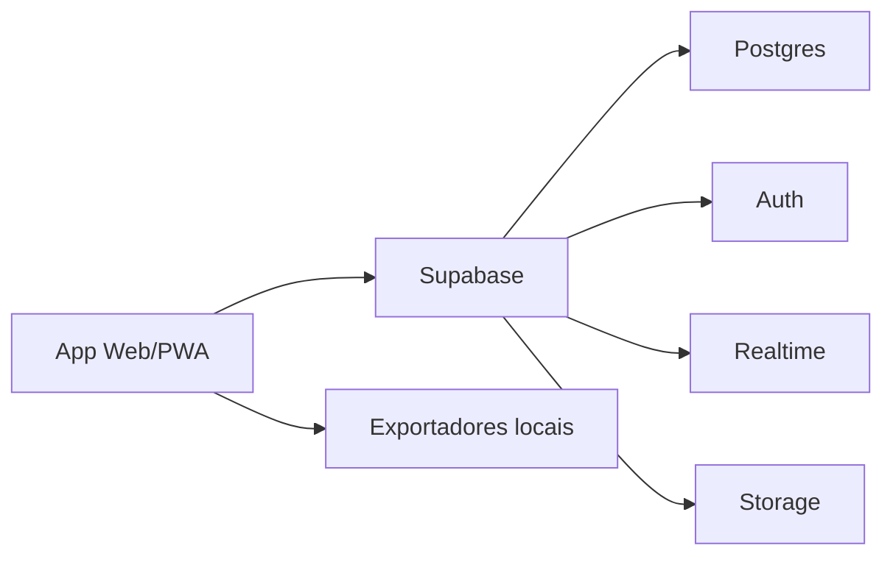

# Arquitetura

## Camadas atuais

- Entrada da SPA: `src/app.js` inicializa estado, autenticacao, eventos globais e renderizacao principal.
- Roteamento por pagina: `src/pages/` agrupa as telas por perfil (`admin`, `encarregado` e `fornecedor`) e monta o registro usado pelo app.
- Configuracao de navegacao: `src/core/navigation.js` centraliza menus por perfil, rotulos de status e nomes de telas.
- Componentes compartilhados: `src/components/` guarda shell da aplicacao, login, helpers visuais e icones.
- Utilitarios: `src/utils/` guarda formatacao de data, dinheiro e escape de HTML.
- Dados iniciais: `src/data/seed.js` centraliza usuarios, tipos de refeicao e pedidos de demonstracao.
- Regras e estado: `src/services/store-v2.js` contem o estado derivado atual; `src/services/store.js` preserva a camada local legada.
- Banco/Supabase: `src/services/database.js` concentra auth, consultas, mutacoes e inscricoes realtime; `src/services/supabase.js` cria o client.
- Exportacao: `src/services/exports.js` gera CSV, Excel, PDF, Word e romaneios.
- Estilos: `src/styles/app.css` concentra a linguagem visual da aplicacao.
- Offline/PWA: `service-worker.js` faz cache dos arquivos principais.

## Estrutura de pastas

```text
src/
  app.js
  components/
    app-shell.js
    auth.js
    icons.js
    shared-ui.js
  core/
    navigation.js
  data/
    seed.js
  pages/
    admin.js
    encarregado.js
    fornecedor.js
    index.js
    settings.js
  features/
    meals/
      domain.js
    operations/
      metrics.js
  services/
    database.js
    exports.js
    store-v2.js
    store.js
    supabase.js
  styles/
    app.css
  utils/
    formatters.js
```

## Direcao da refatoracao

As telas de `encarregado` e `configuracoes` ja foram movidas para `src/pages/`. O `src/app.js` ainda preserva orquestracao, eventos globais, modais e algumas telas administrativas/fornecedor para evitar quebra funcional durante a separacao. A partir desta base, novas telas devem nascer em `src/pages/` ou em subpastas por funcionalidade, e codigo compartilhado deve ir para `src/components/`, `src/core/`, `src/features/`, `src/services/` ou `src/utils/`.

## Arquitetura para producao



## Banco centralizado

As migracoes em `supabase/migrations/` sao a fonte principal do schema em producao. A pasta `database/` preserva scripts auxiliares e historicos de carga/promocao.

## Offline e sincronizacao

No produto final:

- O app grava acoes em IndexedDB quando offline.
- Cada acao recebe um `client_operation_id`.
- Ao voltar internet, o app envia a fila para o backend.
- O backend aplica operacoes de forma idempotente.
- Conflitos sao resolvidos por regra de status e horario limite.
