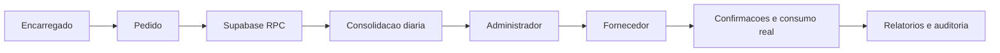

# Arquitetura

## Camadas atuais

- Entrada da SPA: `src/app.js` inicializa autenticacao, estado, eventos globais, renderizacao principal e integracao das telas.
- Roteamento por pagina: `src/pages/` agrupa as telas por perfil (`admin`, `encarregado` e `fornecedor`) e expoe os registros usados pelo app.
- Navegacao: `src/core/navigation.js` centraliza menus por perfil, rotulos de status e nomes de telas.
- Componentes compartilhados: `src/components/` guarda shell, login, helpers visuais e icones.
- Dominio: `src/features/` guarda regras reutilizaveis de refeicoes, operacao e metricas.
- Estado de interface: `src/services/store-v2.js` contem estado derivado, filtros, regras locais e calculos de consolidacao.
- Banco/Supabase: `src/services/database.js` concentra Auth, consultas, mutacoes, RPCs, adaptadores e inscricoes Realtime; `src/services/supabase.js` cria o client.
- Exportacao: `src/services/exports.js` gera PDF, Excel, Word, relatorios e romaneios.
- Estilos: `src/styles/app.css` concentra a linguagem visual responsiva.
- Offline/PWA: `service-worker.js` faz cache dos arquivos principais em producao.

## Estrutura de pastas

```text
src/
  app.js
  components/
    app-shell.js
    auth.js
    icons.js
    shared-ui.js
  core/
    navigation.js
  features/
    meals/
      domain.js
    operations/
      metrics.js
  pages/
    admin/
    encarregado/
    fornecedor/
    index.js
    settings.js
  services/
    database.js
    exports.js
    store-v2.js
    supabase.js
  styles/
    app.css
  utils/
    formatters.js
```

`src/data/seed.js`, `src/services/store.js` e `docs/legacy/database/` permanecem no repositorio como historico de migracao e apoio legado; nao sao a fonte atual de dados do produto. A fonte operacional e o Supabase, com regras de exibicao em `store-v2`.

## Fluxo principal


```mermaid
flowchart LR
  A["Encarregado"] --> B["Pedido"]
  B --> C["Supabase RPC"]
  C --> D["Consolidacao diaria"]
  D --> E["Administrador"]
  E --> F["Fornecedor"]
  F --> G["Confirmacoes e consumo real"]
  G --> H["Relatorios e auditoria"]
```

## Banco centralizado

As migracoes em `supabase/migrations/` sao a fonte principal do schema, das politicas RLS e das funcoes RPC. A pasta `database/` preserva scripts auxiliares de administracao, como promocao inicial de perfis. Modelos e cargas antigos ficam em `docs/legacy/database/`.

Funcoes sensiveis devem conceder `execute` apenas aos papeis necessarios. Rotinas administrativas usam `authenticated` com validacao interna de perfil, e nao devem ficar liberadas para `anon`.

## Direcao de evolucao

- Manter telas novas dentro de `src/pages/<perfil>/`.
- Levar regras compartilhadas para `src/features/` ou `src/services/store-v2.js`.
- Concentrar acesso ao Supabase em `src/services/database.js`.
- Criar migracoes incrementais para qualquer alteracao de schema, RLS ou RPC.
- Validar entrega com `npm run ci` antes de publicar.
